# Malware Analysis Report - Group 2
Malware analysis project including static and dynamic analysis of a real-world sample, with detailed findings, reverse engineering, and network behavior investigation.

## Team Members
- Konstantin Avetisian – 405006442
- Ayush Gowda – 393000595
- Nikita Astionov – 386004799
- Youssef Elgayar – 772003595

## Table of Contents
- Technical Summary
- Static Analysis
- Dynamic Analysis
- Advanced Analysis
- Conclusion

---

## Technical Summary
The group2.pdf file served as a passive delivery container to hide a Windows executable file (group2.exe) embedded within it. From a static PDF analysis, no JavaScript, /OpenAction, or /Launch behavior was exhibited from the document. A single /EmbeddedFile was found within the document, and it was linked to the group2.exe filename from the PDF object analysis. Therefore, the infection chain would have been initiated with a document-based lure that primarily acts to conceal and release a malicious executable payload.

Once extracted from the PDF file, the embedded executable group2.exe was determined to be a very small 64-bit Windows PE loader. It's structure is very unlike that of a normal application in that its PE entry point falls within its own RWX section called .glav, and its import table only lists a single API, KERNEL32!VirtualProtect. This provides compelling evidence that this sample is a shellcode-stager that "fakes" its static imports and instead dynamically resolve their addresses at runtime. Through static reverse engineering the full runtime chain including LoadLibraryA, InternetOpenA, InternetConnectA, HttpOpenRequestA, InternetSetOptionA, HttpSendRequestA, Sleep, VirtualAlloc, InternetReadFile, and ExitProcess was fully reconstructed through a Stephen Fewer style ROR13 hashing resolver.

Dynamic and advanced-dynamic analysis revealed that the executable is a reverse HTTPS Meterpreter stager. At runtime it loads wininet.dll and appropriate network/TLS libraries, makes an ESTABLISHED connection from 212.22.1.50 to 212.22.1.3:8082, and establishes a live Meterpreter session. The debugger shows execution starting immediately in .glav, jumping to the resolver stub, hased call matching LoadLibraryA, then a second corresponding to InternetConnectA (with 0x1F92 corresponding to port 8082). Memory forensics revealed that group2.exe was still running and actively accessing the Internet Settings, ZoneMap, Internet Explorer security and Winsock related registry keys. Taken together the sample most accurately can be viewed as a document-delivered staged loader responsible for instantiating covert remote access via a windows/x64/meterpreter/reverse_https Metasploit workflow.

---

## Static Analysis

In static analysis, a malware sample is analyzed without being run, and identifying characteristics, structural properties, and behavioral intent are derived out of the binary. In the case of `group2.exe`, static analysis was enough to identify the sample, map its command-and-control infrastructure, generate all Windows API calls that the sample would make at runtime, and assign the sample to a particular offensive-security framework with its specific build-time options, all without a single instruction being emulated or executed.

This part will be split into Basic Static Analysis, which identifies file type, structure, and surface-level indicators, and Advanced Static Analysis, which re-creates the malware runtime behavior by disassembling it, performing control-flow analysis, and cross-referencing with known threat-actor techniques. Each screenshot has the group identifier and a system timestamp.

### Basic Static Analysis

#### Initial sample identification

The sample provided to Group 2 came in a single file: `group2.pdf`, which has a size of 295.04 KiB. PDF is an unconventional malware delivery mechanism since PDF files are not directly executable. They are rendered and displayed using a PDF reader application like Adobe Reader, Foxit, the Windows built-in reader, or web browsers rather than by the operating system itself. When malware is delivered as a PDF, it is almost always for one of three reasons: to exploit a vulnerability in the PDF reader software itself, to execute embedded Javascript that will download a separate piece of malware, or to be a passive delivery container that must be manually unpacked by the user. Accordingly, we started by first identifying the correct file type of the given file and by exploring the file to look for signs of which of the three categories applies to the sample.
As the first stage of identification, a Windows GUI tool called Detect It Easy (DIE) version 3.10 which integrates PE identification, packer detection and entropy analysis was used. It was determined that the file was a genuine version 1.7 PDF and that it was "with binary data" is an indication that non-textual streams are being used. They could provide binary data within the document (fonts, images or attachments). On the PDF layer no packers, obfuscators or signature-related anomalies were registered.

*Figure 1: Detect It Easy identifies `group2.pdf` as a legitimate PDF file
(format `PDF(1.7)[with binary data]`).*

In static analysis, we should identify the correct file type before continuing. It is possible that a malicious attacker will "mask" a file with the wrong file extension to trick analysis tools, while the actual magic bytes of the file at the beginning of the file (`%PDF-1.7`) tell which tools we should use in the following stages.

#### Triaging the PDF structure

The `pdfid.py` utility, developed by Didier Stevens, has become the tool of choice for rapid PDF triage. It reads the raw PDF object stream and counts the occurrences of all keywords commonly used to trigger malware, the parts of the PDF specification that both Adobe and 3rd party PDF readers have historically allowed to execute code or pull from external sources. Non-zero count on `/JavaScript`, `/JS`, `/OpenAction`, `/AA`, `/Launch`, `/RichMedia`,
`/JBIG2Decode`, or `/EmbeddedFile` suggests the need for further inspection, whereas any PDF without any of the above is generally harmless.

Executing `pdfid.py` on the `group2.pdf` created a diagnostic profile which significantly reduced the scope of the threat model.

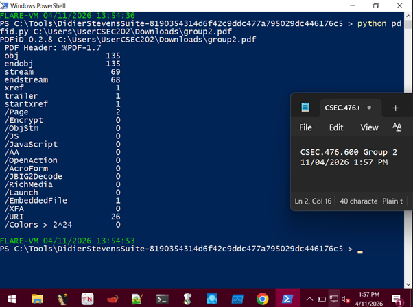

*Figure 2: `pdfid.py` parses the PDF and counts abuse-prone keywords. In
`group2.pdf`, only one such keyword appears: `/EmbeddedFile = 1`. Every
script-execution and auto-action keyword — `/JavaScript`, `/JS`,
`/OpenAction`, `/AA`, `/Launch` — is zero.*

The PDF document seems to not contain any JavaScript that will be executed on load or with user interaction, there is no open action to execute code on open, and there is no launch action which will open a program on load. The only noteworthy anomaly is the presence of a single embedded file, which definitely requires further analysis.

#### Locating the embedded file reference

Now that we have verified the presence of a single `/EmbeddedFile`, we need to determine which PDF object contains the embedded content and what filename is referred to by. The structure of embedded in PDF files follow the certain pattern. Each embedded file is defined by a dictionary, known as the `/Filespec`, which contains the filename, MIME-type and other relationships. The `/Filespec` is then linked via another dictionary (`/EF` or Embedded File) to an individual stream object which contain the bytes of the actual file. Finding this `/Filespec` object would give us the path to the embedded file and so is where we should start.

The command `pdf-parser.py --search Filespec` goes through the graph of objects within the document and returns a list of each `/Filespec` dictionary in the document.

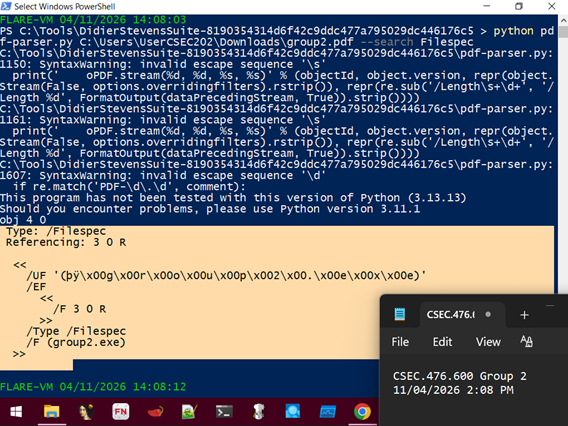

*Figure 3: `pdf-parser.py` locates object `4 0` with `/Type /Filespec`. The
critical line is `/F (group2.exe)` — the filename of the embedded attachment,
stored as an ASCII literal. The parallel `/UF` field encodes the same filename
as UTF-16 for Unicode support (the escape sequence `\x00g\x00r\x00o\x00u\x00p
\x00 2\x002 \x00.\x00e\x00x\x00e` is UTF-16LE for `group2.exe` with a leading
byte-order mark). The `/EF /F 3 0 R` line references object `3 0` as the
container of the actual file content.*

#### Inspecting the embedded file object

Before we extract out payload, we directly inspect the object `3 0` to understand the nature of the structure, specifically, what compression or filters the PDF specification applies to the stream. A PDF stream may be accompanied by any of the combination of `/Filter` values. These commonly occurring values are `/FlateDecode` (zlib deflate which is the compression algorithm used in ZIP), `/ASCIIHexDecode`, `/ASCII85Decode`, `/LZWDecode`, and `/Crypt`. To revert the stream back to the original file, we need to apply these filters in reverse order.

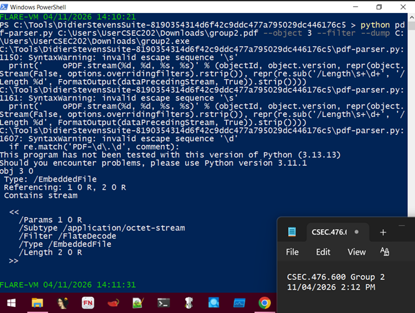

*Figure 4: Object `3 0` is confirmed as `/Type /EmbeddedFile` with
`/Subtype /application/octet-stream` and `/Filter /FlateDecode`. The subtype
`application/octet-stream` is the MIME type for "arbitrary binary data" —
PDF is deliberately not committing to whether the payload is an executable, a
document, or anything else. The `/FlateDecode` filter means the stream bytes
on disk are zlib-compressed, they must be inflated to recover the original
file.*

#### Extracting the payload

Knowing the object and how it's compressed, dumping it was simple. We used `pdf-parser.py --object 3 --filter --dump <outpath>` which applies all defined streams filter sequentially to write the resulting bytes to the specified file. The recovered bytes were saved to `group2.exe` within the downloads directory of the FLARE VM analysis system.

#### Hashing and identifying the recovered binary

After the PE was on the disk as ia standalone file, common identification techniques could be employed.

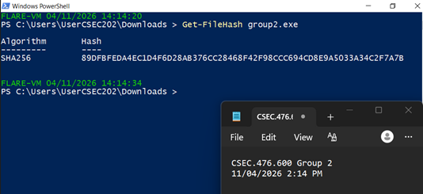

*Figure 5: SHA-256 of the extracted binary*

The hash serves two uses, first is a canonical identifier of the sample, every subsequent finding in this report is attributable to this specific SHA-256 that the reader can recompute and verify on their own copy of the extracted file. Second, hash can be searched against threat intelligence sources like VirusTotal, MalwareBazaar, and Hybrid Analysis to see if the sample has been seen before in the wild.

The complete metadata for the extracted binary is:

| Property  | Value |
|---|---|
| File type | PE32+ executable for MS Windows, x86-64 |
| File size | 7.50 KiB (7680 bytes) |
| MD5       | `0ce70f0f07c21bf4290a1c0308fc4f46` |
| SHA-1     | `1562f662214044749c1fa5601f52332ed347e011` |
| SHA-256   | `89dfbfeda4ec1d4f6d28ab376cc28468f42f98ccc694cd8e9a5033a34c2f7a7b` |
| ssdeep    | `24:eFGSGj30pFLknehtht6dp506WcNYKan2DOIRwQa/FlGVKbuqiksvckOp:iGb0onehthEdc2GJCO1Qa9QQqilk` |

The low size of the binary (less than 8KB) also appears to be a behavioural characteristic. A sophisticated malware application like a banking trojan, a piece of ransomware, or a backdoor, when fully implemented (with their necessary functionality and configuration files, along with statically-linked dependencies in most cases), will often range between several hundreds of kilobytes and several megabytes in size. A Windows PE of 7.5KB has a minimal amount of real code it. It is size that would be expected from a **stager**, a light first-stage payload designed solely for the purpose of downloading and executing the second-stage payload from the attackers' servers in memory. The static analysis conducted below helps to prove this.

#### Threat intelligence lookup

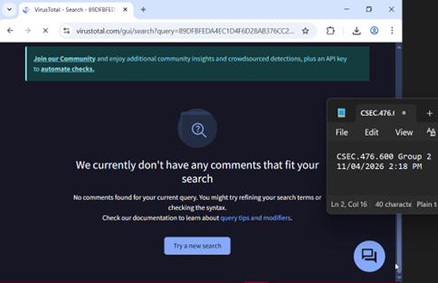

*Figure 6: VirusTotal returns no matching results for the extracted SHA-256
as of the analysis date.* 

The sample has never been seen by any of the AV engines feeding into VirusTotal, nor by the community comment system. A later Hybrid Analysis submission identified both the executable and the PDF samples as malicious with a high threat score and broad AV detection with multiple mapped ATT&CK techniques. Either way, we have to do our own classification and not rely on other external results.

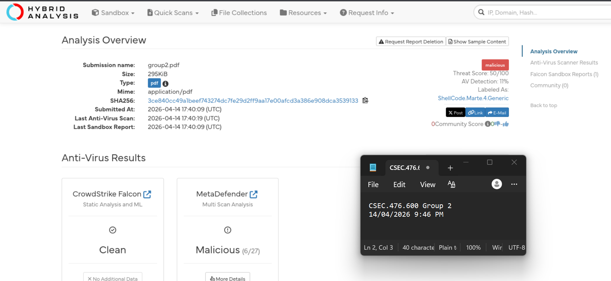

*Figure 7: HybridAnalysis returns matching results for the extracted SHA-256 of the PDF file.* 

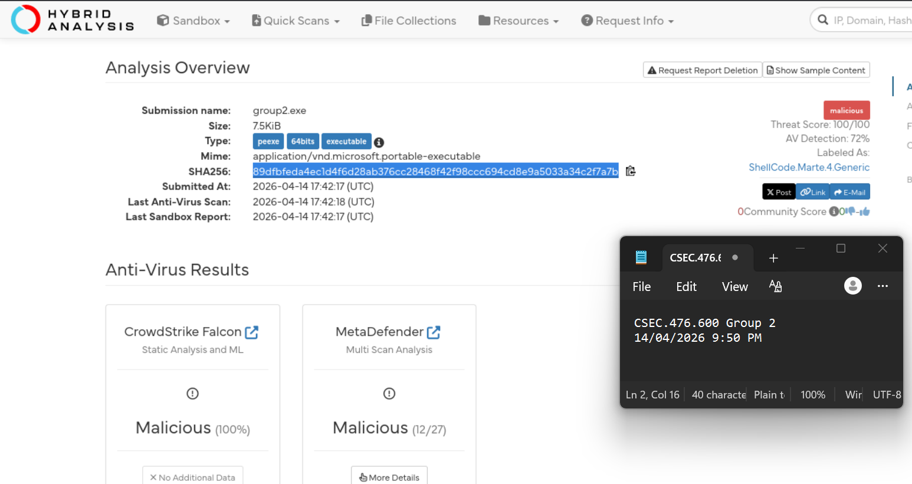

*Figure 8: HybridAnalysis returns matching results for the extracted SHA-256 of the embedded executable file.* 

While the precise family name assigned by public scanning engines differs in some instances, the detections present in Hybrid Analysis is largely in agreement with the structural elements seen previously within the sample. Several of the vendors categorize the file with labels that directly pertain to shellcode or Meterpreter, some examples are Generic.ShellCode.Marte.4.36B77BBF, ATK/Meter-A and Trojan/Win32.Meterpreter. The overall determination from Hybrid Analysis of the sample is that it is malicious, assigning a high threat score. The information gathered from these labels is heuristic, vendor-specific, and not conclusive for assigning definitive attribution, however, it corroborates the conclusion that the PE embedded within is not a standard non-malicious PE, but rather a shellcode-oriented staged loader that operates within the Meterpreter-style reverse HTTPS workflow outlined in further detail below.

#### Binary identification with Detect It Easy

We then used DIE to get the compiler, linker, architecture, and potentially high-level indicators, such as packers or protectors, from the dumped executable.

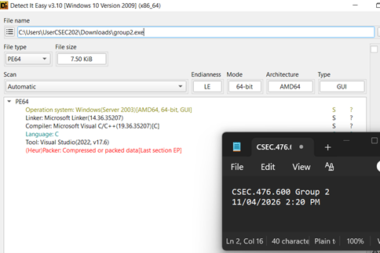

*Figure 9: DIE reports `group2.exe` as a 64-bit GUI-subsystem PE (`PE64`,
`AMD64`, `GUI`), built with Microsoft Visual C/C++ version 19.36.35207 and
linked with Microsoft Linker 14.36.35207 (Visual Studio 2022, v17.6). The
heuristic line `(Heur)Packer: Compressed or packed data [Last section EP]` is
the most interesting single finding from this step* 

DIE's packer heuristic reported the entry point to be in the **last** section of the PE rather than in the first section of the file (`.text`). An normal MSVC produced binary has all executable code located in `.text`, which is the first code section, an entry point in a trailing section will most certainly indicate either a packer that uncompresses and then jumps into the original code or a bespoke loader. Given the file's tiny size, a loader is more probable.

#### PE structure analysis

The portable executable structure of the extracted binary was analyzed with two different, but complimentary analysis tools. PE-bear allowed for exploration and inspection of the binary at the section level, while CFF Explorer was used to examine the section detailed characteristics.

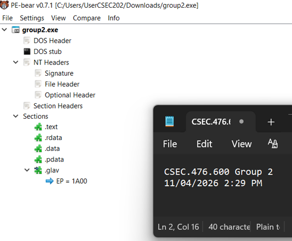

*Figure 10: PE-bear's tree view of `group2.exe`.*

The section tree has 5 sections, named `.text`, `.rdata`, `.data`, `.pdata`, and `.glav`. The first four sections are as expected from the Microsoft linker output for a 64 bit PE. The section named `.glav` is **non-standard**. Normally, this section will not be generated by Microsoft's linker under any default compilation settings. The entry point mark (`EP=1A00`) clearly shows the program starts execution at this location inside `.glav`, which is the last loaded section. This is an clear indicator of a manually assembled PE loader with an embedded shellcode, not a typical compiled program.

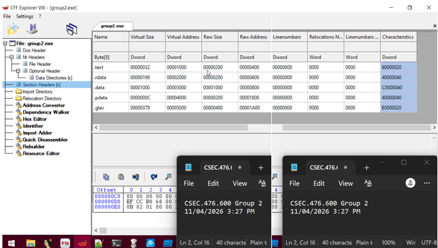

*Figure 11: CFF Explorer VIII section characteristics table. The `.glav`
section has virtual size `0x375`, virtual address `0x5000`, raw size `0x400`,
and **Characteristics `0xE0000020`**. This value decodes to the bitwise OR
of four PE section flags: `IMAGE_SCN_CNT_CODE (0x00000020)`,
`IMAGE_SCN_MEM_EXECUTE (0x20000000)`, `IMAGE_SCN_MEM_READ (0x40000000)`, and
`IMAGE_SCN_MEM_WRITE (0x80000000)`.* 

The combinations `MEMEXECUTE | MEMREAD | MEM_WRITE`, or simply RWX, is exceedingly rare to find among normal applications. Compilers ans operating systems enforce the W^X principle, stating a page can either be writable or executable, but not both through the use of section flags in compilation time and Data Execution Prevention at runtime. If a PE section is built with the RWX flag, it bypasses this first layer of security and suggests a shellcode container: code which needs to be writeable, as it will alter itself while executing, and executable, as it is the final place the control is transferred to.

Given the combination of the name of the section, `.glav`, the section having RWX permissions, the entry point being located within the trailing section, and the presence of very little content within the `.text` section clearly indicates that `group2.exe` is not a normal program, but a loader. The other sections, `.text`, `.rdata`, `.data`, `.pdata`, have been added purely to make it seem like a fully compliant PE, when the main part of the malicious application is in fact in `.glav`.

#### Entropy analysis

The expected next step after finding something unusual is to check the entropy of its contents. This gives a value from 0-8 (measured in bits per byte) indicating how randomly distributed the byte values are in that region of the file. This value often indicates what kind of data is stored: a value close to 0 means repetitive data (e.g. long runs of the same byte), 4-5 indicates ASCII text, 5.5-6.5 means x86/x64 machine code and anything above 7.5 is likely compressed/encrypted.

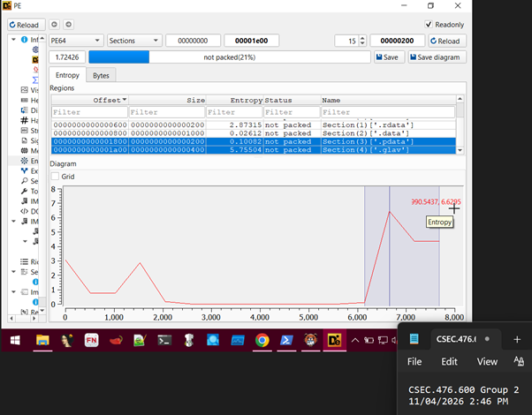

*Figure 12: Detect It Easy's entropy analysis of `group2.exe`.*

While the heuristic scanner in DIE flags the binary as "probably packed" (Figure 9), the entropy analyzer says "not packed (21%)" at the end. As seen from the two analyses, the two subsystems are looking at two different things. The heuristic analysis looks for **structural** clues that a packer may be used (location of the EP, arrangement of the sections, format of the IAT). The entropy analysis, on the other hand, looks for **statistical** clues (distribution of the bytes values). A "packed" file must display both features: it must show a structural anomaly, and the section containing the compressed data must have an entropy that suggests its content is not regular machine code (e.g., entropy of 7.5 bits/byte or higher). In this case, section entropies are: 2.87 bits/byte (`.rdata`), 0.03 (`.data`), 0.10 (`.pdata`) and 5.76 (`.glav`). Overall file entropy is 1.72 bits/byte. The entropy 5.76 bits/byte in section `.glav` is indeed higher than that in other sections. It correlates with the local maximum seen in the entropy plot around this section, showing a peak of about 6.6 bits/byte. However, this peak is well within the expected entropy for tightly hand-written x64 machine code (which can be in the range 5.5-6.5 bits/byte), and very far from the threshold that would suggest encryption (about 7.9 bits/byte) or compression (about 7.5 bits/byte). In summary, the reason for two different results from the tools is: this binary shows the **structure** of a packed file (EP located inside a trailing custom section), but not the **content**. It is the signature of a shellcode loader. Machine code in `.glav` is intended for direct execution in x64, not for unzipping before being executed. As confirmed below in the "Advanced Static Analysis" section, this implies we will be able to disassemble this section directly without having to peel off any encryption or compression wrapper.

#### Import Address Table

PE file's Import Address Table (IAT) is the list of externall DLL functions that the binary declares that it will need to import at load time. Once loaded, the Windows loader binds each entry in the IAT to a function pointer before control is passed to the entry point of the program. Usually the IAT is one of the most useful sources of information to a static analyst: an application that imports `CreateFileA`, `WriteFile`, and `CloseHandle` clearly performs file I/O, an application that imports `InternetOpenUrlA` and `HttpSendRequestA` performs HTTP, and an application that imports `CryptAcquireContextA`, `CryptHashData`, and `CryptEncrypt` performs cryptography. Typically, the IAT of a PE provides a good summary of the functions used by the executable.

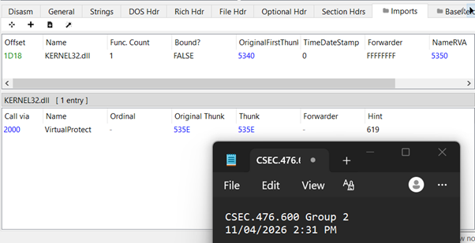

*Figure 13: The complete Import Address Table of `group2.exe`.*

Interestingly, there is only **one** function imported among all DLLs: `KERNEL32.dll!VirtualProtect`. It is extraordinary. A Windows GUI Application (as PE Header tells us that this binary is one) should import at least window-creation, message-pump and GDI functions from `user32.dll` and `gdi32.dll`, and lots of utility functions from `kernel32.dll`. A 1-function IAT is not only small, but also the smallest possible useful IAT.

The interpretation is simple and follows the well-documented malware technique: **the binary does not declare its dependencies in the import table because it looks them up dynamically at runtime**. In other words, instead of relying on the Windows loader to fill in pointers for WinINet, kernel, and networking functions in the IAT, it does the look up on its own. By walking the Process Environment Block (PEB) at runtime and enumerating through loaded modules, it will then hash the exported function name with a very lightweight hashing function and compare that hash value against pre-defined hash constants in the shellcode. This method is called **API hashing**, and was made famous by Stephen Fewer in mid-2000s when he released his public version of `block_api` shellcode. There are two obvious defensive purposes for the attacker. Static analysts looking only at the IAT can't tell what the intentions of the binary are, since the real API call surface lies behind meaningless 32-bit hashes. Also, the absence of an IAT reference to, for example, `InternetConnectA` makes the binary safe from generic detection rules flagging any binary importing functions for WinINet as suspicious.

The only import present, `VirtualProtect`, is in line with this assumption as a runtime loader will need to make the code pages executable after writing them and `VirtualProtect` is the standard Windows API call to set memory-protection flags on an allocated region. Because the loader will be able to gain a valid function pointer to `VirtualProtect` via the IAT and no function signature maliciousity would appear to be tied to this single function the attacker has built out the rest of its API resolution mechanism from this one starting point.

#### Static string extraction

From a binary, the extracted strings can provide details such as URLs, filenames, error messages and configuration data that are hardcoded in the executable. In addition to the basic `string` utility, FLOSS (FireEye Labs Obfuscated String Solver) was used as control-flow analysis on the executable, which is able to recover strings that are assembled or decoded at runtime instead of being statically defined.

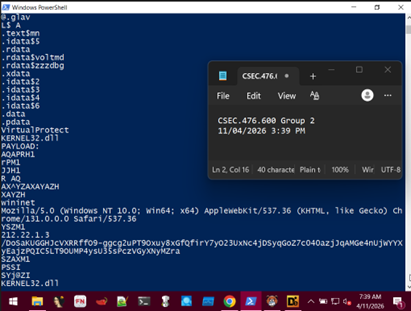

*Figure 14: FLOSS static strings output — the richer half.*

Prominent extracted strings include: the PE sections and directory labels (`.text$mn`, `.rdata`, `.idata$5`, `.xdata`, `.idata$2`, `.idata$3`, `.idata$4`, `.idata$6`, `.data`, `.pdata`, `.glav`). Some PE import table entries include `VirtualProtect`, `KERNEL32.dll`. It also contains a literal string which is presumably a shellcode marker: `PAYLOAD:`, short ASCII strings such as `AQAPRH1`, `rPM1`, `JJH1`, `R AQ`, `AX^YZAXAYAZH`, `XAYZH`, `YSZM1`, `SZAXM1`, `PSSI`, `SYj@ZI`. Other extracted strings are `wininet`, an entire Mozilla/Chrome HTTP User-Agent string (`Mozilla/5.0 (Windows NT 10.0; Win64; x64) AppleWebKit/537.36 (KHTML, like Gecko) Chrome/131.0.0.0 Safari/537.36`), an IP address (`212.22.1.3`) and a long 120-character URI-like blob starting with `/DoSaKUGGHJcVXRRffO9-....`.

The short ASCII fragments (`AQAPRH1`, `AX^YZAXAYAZH`, `SZAXM1`, etc.) are
not meaningful text. They are **x64 instruction opcode bytes that happen to
fall within the printable ASCII range** and were therefore caught by the
string extractor. For example, `A` is `0x41` which is the REX.B prefix
commonly used in x64; `Q` is `0x51` which is `push rcx`; `P` is `0x50` which
is `push rax`; `R` is `0x52` which is `push rdx`; `Z` is `0x5A` which is
`pop rdx`; `H` is `0x48` which is the REX.W prefix that makes an instruction
64-bit; `1` is `0x31` which is the opcode for `xor r/m, r` when combined
with a ModR/M byte. A sequence such as `AX^YZAXAYAZH` decodes as a cascade
of push/pop/xor instructions shuffling register values — the kind of
register-juggling that occurs at function epilogues and prologues in hand-
written shellcode. These fragments are therefore not "strings" in the usual
sense but fingerprints of the shellcode instruction stream being swept up by
a text extractor.

The remaining notable strings each correspond to a specific malware
behavior:

- `wininet` is the name of the Windows HTTP client library. Its presence as
  a string, combined with the complete absence of `wininet.dll` functions
  from the IAT, implies the library is loaded at runtime via `LoadLibraryA`
  rather than being declared as a static dependency.
- The Mozilla/Chrome User-Agent is the string value the malware will present
  to the C2 server in the `User-Agent` header of its HTTP requests.
  Impersonating a mainstream browser is a standard evasion technique against
  network-layer detection systems that flag unusual User-Agents.
- `212.22.1.3` is a hardcoded IPv4 address, very likely the command-and-
  control server. Hardcoded IPs are fragile for attackers (the address
  becomes an immutable IOC the moment any network defender observes it) but
  are the default msfvenom behavior and are consistent with a training
  sample.
- The 120-character `/DoSaKU…MZra` blob is the most distinctive string. Its
  character set (`A–Z`, `a–z`, `0–9`, `-`, `/`) resembles a URL-safe base64
  encoding with the `+` symbol replaced by `-`. This string became a central
  focus of the Advanced Static Analysis below.

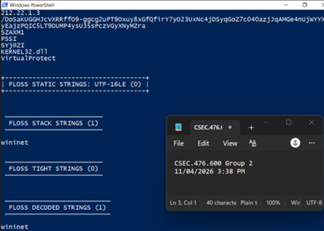

*Figure 15: FLOSS stack strings and decoded strings output.*

Besides the already listed static strings, FLOSS reported precisely one stack string (`wininet`) and one decoded string (also `wininet`). Stack strings are constructed byte-by-byte at run time and are a form of obfuscation; these strings do not exist as contiguous data anywhere in the binary. Decoded strings are strings FLOSS has determined are the result of a run-time decoding routine. Since FLOSS could only find `wininet` via these two methods, this leads us to believe that the binary construction this string in the stack at run time instead of having it in `.rdata`. All of the remaining data (User-Agent, IP address, URI, section names) seem to be present statically. This is consistent with what we would expect to see if the shellcode used this one string (`wininet`) for its call to `LoadLibraryA` very early in its execution.

#### Automated capability extraction

Mandiant's `capa` tool automatically identifies malware capabilities by matching against a library of many thousands of rules when fed the binary's disassembly, imports, and strings. The results are described in natural language (e.g., "resolves function by hash", "connects to http server", "contains obfuscated stack strings") and this is among the fastest methods for sanity-checking a manual analysis. However, for `group2.exe` it gave an unusual result:

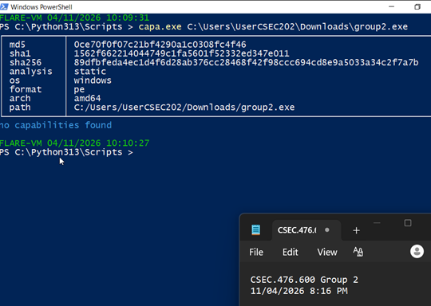

*Figure 16: `capa` reports "no capabilities found" for `group2.exe`.*

This is the null result, none of capa's thousands of capability rules matched against the binary. This is not an error, rather, this is the expected outcome given the binary. Capa relies very heavily on characteristic IAT imports, as well as typical assembly sequences to detect specific functionality, and this binary actually dynamically resolves each API at runtime, meaning there are no traditional import references for capa rules to look for. Paradoxically, capa's failure to detect anything is the evidence of API hashing, and considering that 99.9% of actual malware will have at least a couple of capa rules match, a zero capability signature is the perfect evidence for something advanced, and leads us to the manual techniques described in the Advanced Static Analysis section.

#### Authenticode signature check

Windows executables may be digitally signed by the software publisher via Microsoft's Authenticode scheme. A valid digital signature leads back to a certificate authority that can be trusted and indicates the true identity of the publisher. Most malware are not digitally signed, though sophisticated threats sometimes use stolen and fake digitally signed certificates. We checked the digital signature using the `osslsigncode` open-source utility.

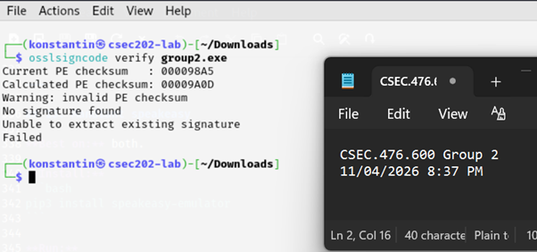

*Figure 17: `osslsigncode verify group2.exe` reports "No signature found".*

This binary is unsigned, which is what you'd expect from a sample generated by Metasploit. Even more telling is the other warning message `invalid PE checksum` here. The `osslsigncode` notes that the PE's reported checksum (`0x000098A5`) does not match its own computed checksum from the data of the PE file (`0x00009A0D`). An invalid PE checksum can occur if the linker's `/RELEASE` switch wasn't used. In this case, the checksum field would remain blank and take the default zero value, however the field here has a non-zero value. The other option is that the PE has been modified after being linked, and as we'd expect for Metasploit payload, a sample from `msfvenom` takes a previously linked PE template and patches a stager shellcode into it, meaning any prior checksum would become irrelevant, hence pointing towards msfvenom-produced PE.

#### Secondary PE survey with rabin2

Finally, a Basic Static Analysis step using `rabin2` (the radare2 suite's binary-information tool) was performed in order to double-check the results found by the Windows-native tools.

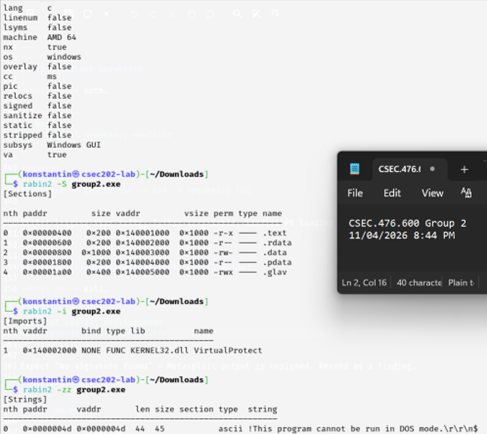

*Figure 18: `rabin2` cross-verification.*
`rabin2 -I` confirms the PE-level properties (machine `AMD64`, subsystem `Windows GUI`, `nx: true`,
`signed: false`, `stripped: false`). `rabin2 -S` prints the five-section
layout, explicitly showing the permission strings: `.text` as `-r-x`,
`.rdata` as `-r--`, `.data` as `-rw-`, `.pdata` as `-r--`, and `.glav` as
`-rwx`. `rabin2 -i` confirms the single-entry IAT
(`KERNEL32.dll / VirtualProtect`). `rabin2 -zz` prints all strings including
the `!This program cannot be run in DOS mode.` DOS stub message. Every
finding from the Windows-side tools is corroborated by the Linux-side
tools, giving high confidence in the Basic Static Analysis conclusions.

#### Summary of Basic Static Analysis findings

In summary of Basic Static Analysis, we determined: a small (7.5KiB) 64-bit Windows PE was extracted from a PDF attachment, it was compiled with MSVC 2022 and re-processed in a way that invalidated its checksum; the entry point lies within the non-standard (read+write+execute) section `.glav`, the import table contains only the function `VirtualProtect`, API resolution therefore must be achieved via some alternate method at runtime, strings include a hardcoded C2 IPv4 address (`212.22.1.3`), a Chrome User-Agent, mention of the `wininet` HTTP library and a distinctive 120-character ASCII string starting with `/DoSaKU`. It is not recognized by `capa` as having any common capabilities as all API references are resolved at runtime, it is not signed, and is not on VirusTotal. However, it was identified as shellcode-oriented staged loader that operates within the Meterpreter-style reverse HTTPS workflow by HybridAnalysis.

The collective findings lead to the inference of a minimalist HTTP(S)-based downloader functioning as a shellcode loader. The Advanced Static Analysis below validates the hypothesis and provides details of the framework, variation and build-time options which was used to generate the sample.

**Tools used in Basic Static Analysis:** Detect It Easy (DIE), Didier Stevens
Suite (`pdfid.py`, `pdf-parser.py`), PowerShell `Get-FileHash`, VirusTotal, HybridAnalysis,
PE-bear, CFF Explorer VIII, FLOSS, capa, osslsigncode, rabin2 (radare2
suite).

---

### Advanced Static Analysis

We've already discovered in Basic Static Analysis that `group2.exe` is a shellcode loader and has a custom RWX section, dynamically resolving APIs and hardcoded runtime parameters. In Advanced Static Analysis, we're hoping to complete the picture and determine what the shellcode actually does: find the algorithm used to resolve the APIs, determine all the Windows function calls it will make during runtime, recover what the 120-character long `/DoSaKU...` blob is and attribute the sample to a specific malware family or toolkit.

#### Ghidra disassembly. First approach to the stager

The primary static disassembler was Ghidra. We identified the 120 character string that appears to be a URI within Basic Static Analysis, and searched for that string within Ghidra's defined strings, following its cross-references in the code. It is referenced inline within a function labeled `FUN_140005191` just after a `call` instruction.

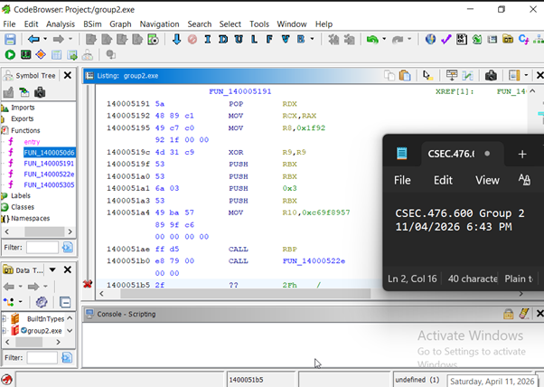

*Figure 19: Ghidra's disassembly of `FUN_140005191`.*

The argument preparations for a call to WinINet are configured here. `mov r8, 0x1f92` stores a 4-byte immediate that is later revealed to be the port number. `xor r9, r9` zeroes a register that is later used as a NULL argument. `push rbx` and `push 0x3` store stack arguments that will be used in the API call (service `0x3` is `INTERNET_SERVICE_HTTP`) respectively. `mov r10, 0xc69f8957` stores the 32-bit constant that will later be revealed as the ROR13 hash of `InternetConnectA`. `rbp 0x1400051ae` calls this API function. Next, `call FUN_14000522E` at `0x1400051b0` hands control to the next function in the stager chain, and the byte right afterwards at `0x1400051b5` is `0x2f` (`/`), which is the first byte of the `/DoSaKU...` URI and Ghidra automatically annotates it as an unknown (`??`) because the bytes are located inside the code section instead of a data region.

What's structurally interesting is that the ASCII string is directly following the `call` instruction. When a `call` instruction in x86-64 is executed, it will first push the return address onto the stack (the address of the instruction following the call) and jump to the callee. When a callee starts with a `pop` of a register of the stack it gets the address of whatever bytes happened to immediately follow the `call`. This technique of calling and immediately following with pop is known as the CALL/POP technique to give position independent shellcode a pointer into its own code space without a data segment, or knowledge of where the code will be loaded.

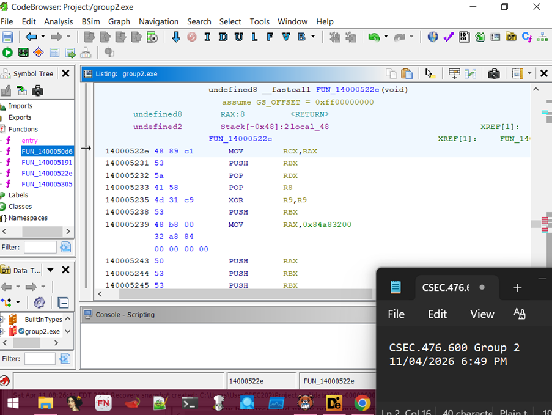

*Figure 20: Ghidra's disassembly of `FUN_14000522E`.*

The function begins with `mov rcx, rax`, loading the handle of the connection from the previous `InternetConnectA`, following the call, `push rbx / pop rdx` stack alignment, and finally `pop r8` taking out return value from stack where it was stored by previous `call`. This return value is `0x1400051b5` which is beginning of inline /DoSaKU...URI because of the previous `call Fun_14000522E` at `0x1400051b0`. In `r8` we have the address of the URI string. Now, with `xor r9, r9`, push and `mov rax, 0x84a83200`, the other parameters are passed in the next call, where `0x84a83200` is a WinInet request flags bitmask where `InternetFlagSecure (0x00800000)`. The value tells the next call that this is an HTTPS request.

This explained the `/DoSaKU...` String. It's not encrypted. It's not compressed. It's just plaintext ASCII data tucked in the middle of the code section instead of in `.rdata`, and retrieved from the x86-64 call convention push of the return-address onto the stack. Malware pulls its own URI out of its own instruction stream the first time through the `call`.

#### The URI checksum — a Metasploit-specific indicator

Since we have successfully recognized the URI as plain text data in the form of an argument to a WinINet function, the final thing we must investigate is if the URI itself holds any specific meaning. We performed a quick entropy calculation and concluded that the URI does not contain a base64 encoded payload, the 5.43 bits-per-character rating is that of truly random data and no permutation of the alphabet makes the encoded data intelligible.

Another vector was more successful. In Metasploit's reverse-HTTP staged payload model, Metasploit differentiates valid stager requests from arbitrary HTTP requests by placing a checksum over the requested URI. More precisely, Metasploit calculates `sum(ASCII bytes of URI) mod 256`, and checks if it equals one of the handful of magic constants known. If so, the request is considered a stager handshake, and the correct second-stage payload is served. These constants are kept in `lib/rex/payloads/meterpreter/uri_checksum.rb`:

| Constant | Value | Meaning |
|---|---|---|
| `URI_CHECKSUM_INITP` | 80 | Python stager handshake |
| `URI_CHECKSUM_INITJ` | 88 | Java stager handshake |
| `URI_CHECKSUM_INITW` | 92 | 32-bit Windows stager handshake |
| `URI_CHECKSUM_INITW_X64` | **139** | **64-bit Windows stager handshake** |

Computing the checksum of the recovered URI yields `sum(ord(c) for c in "/DoSaKUGGHJcVXRRffO9-ggcg2uPT9Oxuy8xGfQfirY7yO23UxNc4jDSyqGoZ7c040azjJqAMGe4nUjWYYXyEajzPQIC5LT9OUMP4ysU35sPczVGyXNyMZra") % 256 = 139`.

A match to 139 (`0x8B`) positively identifies the sample as a Windows 64 bit Metasploit stager. The scheme used for calculating the checksum is documented in the source of Metasploit itself, comes bundled with every installation of the framework, and would not appear coincidentally in anything non-Metasploit. We can now proceed with the analysis knowing for certain where the sample comes from and use the Metasploit upstream source code to confirm our other results.

#### Shellcode entry-point discovery with radare2

Once we determined the framework identity we focus on the shellcode. Metasploit's x64 Windows shellcode blocks have a canonical entry prologue that always start with the following byte sequence `fc 48 83 e4 f0` which is deciphered as `cld; and rsp, 0xfffffffffffffff0`, that cleans the direction flag and aligns the stack to 16 byte boundaries as stipulated by the x64 calling convention. In the case of `group2.exe` we searched for this prologue in radare2:

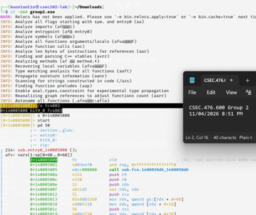

*Figure 21: radare2 identifies the shellcode entry point.*

Executing the command `/x fc4883` searches for the byte string `fc 48 83` and will return precisely one instance at virtual address `0x140005000`. Following that address, disassembly show the entire Stephen Fewer `block_api` resolver prologue: `cld` (clear direction-flag), `and rsp, 0xfffffffffffffff0` (stack-align), `call sub.fcn.1400050d6` (jump into the body of the resolver) then the usual register-saving push commands: `push r9, push r8, push rdx, xor rdx, rdx, push rcx`. The next instruction `mov rdx, gs:[rdx+0x60]` is the canonical x64PEB access: `gs:[0x60]` is the offset of the Thread Environment Block (TEB) that points to the Process Environment Block (PEB) base. The following two instructions (`mov rdx, [rdx+0x18]` and `mov rdx, [rdx+0x20]`) walk `PEB.Ldr` and `Ldr.InMemoryOrderModuleList`(following the linked list of loaded modules), radare2labels these at `0x140005000`: `entry0`, `hit9_0`(where our search located it) and `rip`. This confirms our previous conclusion: The PE entry-point of the file is actually where our shellcode begins - there is no separate PE wrapper. The section banner indicates that this is part of the `.glav` section and marked `-rwx`).

The sequence of instructions, from `0x140005000` upwards, isn't just like Metasploit's `block_api.asm`, it's byte-for-byte the same as the one at the upstream source: `metasploit-framework/external/source/shellcode/windows/x64/src/block/block_api.asm`. Each byte of the prologue, each register selection and each stack instruction matches. It's the logical equivalent of matching fingerprints.

#### Enumerating all API calls

All API calls through the resolver use the following format: The shellcode load the ROR13 hash for the target function name (as 32 bit hash) in `r10`, place other arguments in the standard argument positions (`rcx`, `rdx`, `r8`, `r9` and on the stack) and `call rbp` in order to jump to the resolver. The resolver will return once the resolved function has been called with its return value stored in `rax`. The address for the resolver will stay in `rbp` for the entire lifetime of the shellcode.

To enumerate every API call, we searched for the byte pattern `ff d5` — the x64 encoding of `call rbp` — across the entire binary.

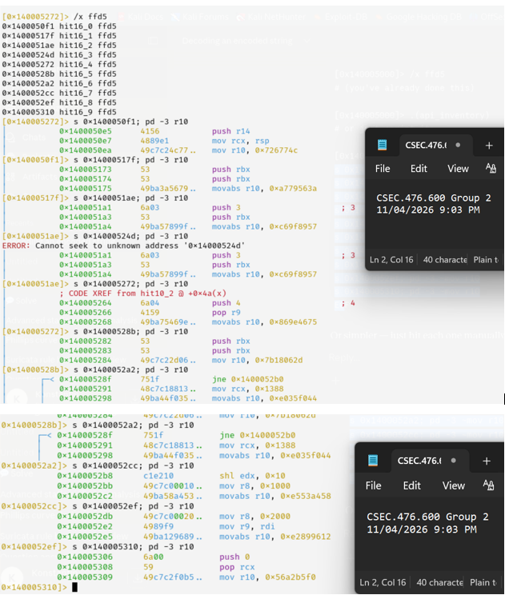

*Figure 22: radare2 extraction of hash constants and arguments at the final
four `call rbp` sites in the shellcode.*

Using the prior instructions at `0x1400052a2`, the call to `jne 0x1400052b0 / mov rcx, 0x1388 / movabs r10, 0xe035f044` can be found to be `Sleep(5000)`. This is due to `0x1388` being 5000 in decimal, meaning the sleep time is indeed 5 seconds. Using the instructions at `0x1400052cc`, the call to `shl edx, 0x10 / mov r8, 0x1000 / movabs r10, 0xe553a458` can be seen to be `VirtualAlloc`. The `shl edx, 0x10` creates `0x400000` (4 MiB) from `0x40` (which is also `PAGE_EXECUTE_READWRITE`) and `r8=0x1000` is `MEM_COMMIT`, thus it is `VirtualAlloc(NULL, 0x400000, MEM_COMMIT, PAGE_EXECUTE_READWRITE)`. At `0x1400052ef`, `mov r8, 0x2000 / mov r9, rdi / movabs r10, 0xe2899612` identifies the call to `InternetReadFile` with a size of 0x2000 (8 KB). Finally, the `push 0 / pop rcx / mov r10, 0x56a2b5f0` at `0x140005310` can be identified as `ExitProcess(0)`.

Combining this extraction with the earlier hashes visible in the Ghidra disassembly (Figures 19 and 20) and additional radare2 seeks across the remaining call sites produced the complete API call inventory:

| # | Call site     | ROR13 hash   | Resolved API          | Purpose                                |
|---|---------------|--------------|----------------------|----------------------------------------|
| 0 | `0x1400050f1` | `0x0726774C` | `LoadLibraryA`       | Loads `wininet.dll`                    |
| 1 | `0x14000517f` | `0xA779563A` | `InternetOpenA`      | Creates WinINet session; sets User-Agent |
| 2 | `0x1400051ae` | `0xC69F8957` | `InternetConnectA`   | TCP connect to `212.22.1.3`            |
| 3 | `0x14000524d` | `0x3B2E55EB` | `HttpOpenRequestA`   | Prepares HTTPS GET with inline URI     |
| 4 | `0x140005272` | `0x869E4675` | `InternetSetOptionA` | Disables certificate validation        |
| 5 | `0x14000528b` | `0x7B18062D` | `HttpSendRequestA`   | Sends the HTTPS request                |
| 6 | `0x1400052a2` | `0xE035F044` | `Sleep`              | 5000 ms between failed-send retries    |
| 7 | `0x1400052cc` | `0xE553A458` | `VirtualAlloc`       | Allocates 4 MiB RWX stage-2 buffer     |
| 8 | `0x1400052ef` | `0xE2899612` | `InternetReadFile`   | Downloads stage-2 in 8 KB chunks       |
| 9 | `0x140005310` | `0x56A2B5F0` | `ExitProcess`        | Exit code 0 on failure                 |

All hashes within this table correspond to the canonical Stephen Fewer ROR13 hash for the respective Windows API in the Metasploit framework sources. There is a direct and complete mapping: no hash will be missing, no hash will not map, no hash will be superfluous. A ten for ten against the `block_reverse_https.asm` upstream.

#### Interpretation — complete runtime behavior

Putting it all together (the API inventory, the argument values and the URI checksum result) give us a complete behavioral profile of group2.exe, with no actual execution:

1. The PE is mapped into memory by the Windows loader when it is launched. The entry point is at the beginning of the `.glav` section (`0x140005000`, marked RWX) and control is transferred to there immediately.
2. The two first instructions are `cld` and `and rsp,-16` (both in the standard C call preamble; clearing the direction flag and preparing the stack.).
3. A `call` into the API-resolver stub initializes `rbp` to point to the resolver itself. From then on, every WinINet and Kernel32 call made throughout the entire execution of group2.exe is dispatched through `rbp` based on the 32-bit ROR13 hash in `r10`.
4. The `LoadLibraryA("wininet")` function loads the HTTP library.
5. `InternetOpenA` opens a WinINet session, giving the hardcoded `Mozilla/5.0 ... Chrome/131.0.0.0` User-Agent.
6. `InternetConnectA` connects to the C2 at `212.22.1.3` using service type `INTERNET_SERVICE_HTTP`. The port is popped from the immediate `0x01BB` (decimal 8082) in an argument-preparation instruction.
7. `HttpOpenRequestA` prepares an HTTP GET request with the inline URI as the object name. The flags `0x84A83200` specify the connection as HTTPS, using `INTERNET_FLAG_SECURE`.
8. `InternetSetOptionA` is used with option 31 (`INTERNET_OPTION_SECURITY_FLAGS`) and the value `0x3380`; effectively disabling all validation of certificates, which is necessary since the Metasploit C2server uses a self-signed TLS certificate.
9. `HttpSendRequestA` attempts to send the request. If it fails it will call `Sleep 5000` then retry, after ten tries it will continue through to `ExitProcess(0)`.
10. Upon successful transmission `VirtualAlloc` allocates a 4 MiB RWX buffer into which it will download the stage-2 payload.
11. `InternetReadFile` downloads the returned data stream in 8 KiB chunks until it's depleted, and appends them to the RWX buffer.
12. Control transfers to the start of the buffer, now containing the stage-2 payload, via a `pop rax; ret` instruction. The stage-2 payload is the Meterpreter reflective DLL by design.

This description — retry policy, buffer sizes, cert-validation bypass, chunk size, exit behavior — corresponds line-by-line with Metasploit's published `block_reverse_https.asm` source file, confirming both the framework and the specific stager variant.

#### Quantitative similarity against vanilla msfvenom output

For one more independent piece of evidence, and to zero in on the specific msfvenom build options used in the sample generation, a reference binary was created using what can be assumed to be the appropriate build parameters; payload `windows/x64/meterpreter/reverse_https`, LHOST `212.22.1.3`, LPORT `8082` and output file format `exe`. The following shows a comparison between this reference binary and `group2.exe` using the ssdeep fuzzy-hashing algorithm. The ssdeep comparison returns a similarity score between 0-100, generated by context-triggered piecewise hashing (a method for comparing files that is resistant to small edits and insertions in the compared data).

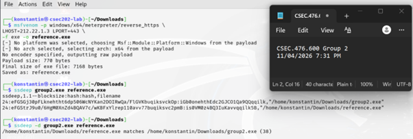

*Figure 23: Generation of a vanilla Metasploit reference binary and ssdeep
similarity comparison.*

The reference: `reference.exe` is 7168 bytes. The two files, `group2.exe` and `reference.exe` have a similarity score of 38/100. Looking at the two ssdeep hashes side-by-side the substrings `eFGS` are common at both ends, and both have the substring `qqilk` at their end, suggesting both files are highly similar structurally at similar offsets. The score of 38/100 is based on the similarity score considering all the PE wrappers that differ between the two binaries. The higher similarity at the ends reflects shared PE header standards and common shellcode prologues.

#### Summary of Advanced Static Analysis findings

`group2.exe` is a Metasploit Framework `windows/x64/meterpreter/reverse_https` stager; it's built with `EXITFUNC=process` and connects back to `https://212.22.1.3:8082/DoSaKUGGHJcVXRRffO9-ggcg2uPT9Oxuy8xGfQfirY7yO23UxNc4jDSyqGoZ7c040azjJqAMGe4nUjWYYXyEajzPQIC5LT9OUMP4ysU35sPczVGyXNyMZra`. The stager includes three evasion mechanisms: the API-hashing resolver, by Stephen Fewer, so its imports are not static; the self-signed TLS certificate bypass so its C2 channel can pass as normal HTTPS; and a URI-checksum handshake, to make its initial C2 request indistinguishable from random web-browsing to anyone unaware of the handshake. Upon a successful connection it then downloads and transfers execution into a stage-2 payload of 4MiB, which in the framework convention is a reflectively-loaded Meterpreter DLL. Support for attribution is through the URI checksum result (139 = `URICHECKSUMINITWX64`), a byte-exact match of its shellcode prologue with Metasploit's upstream `block_api.asm`, and a ten-out-of-ten match of its ROR13 hashes of every API with Metasploit's hash table. It shares flag constants, and retry policies and has an ssdeep similarity of 38 to locally generated, vanilla reference (4MB stage).

**Tools used in Advanced Static Analysis:** Ghidra (disassembly and cross-reference navigation), radare2 (`-AAA` auto-analysis, `/x` byte-pattern search, `pd` disassembly, `s` seek), Python (URI checksum computation), `msfvenom` (reference binary generation), `ssdeep` (fuzzy-hash similarity comparison), the Rapid7 Metasploit Framework source code (`external/source/shellcode/windows/x64/src/block/block_api.asm`, `external/source/shellcode/windows/x64/src/block/block_reverse_https.asm`, `lib/rex/payloads/meterpreter/uri_checksum.rb` — used as authoritative reference for ROR13 hash values, flag constants, and URI checksum constants).

## Dynamic Analysis

Static analysis determined that the initial delivery artifact group2.pdf contains a single embedded PE,group2.exeand no of the standard PDF actions that are typically found in a file designed to automatically execute an embedded application (e.g. /JavaScript, /JS, /OpenAction, /AA, or /Launch). Dynamic analysis therefore was split into two parts: to check if just the act of opening the PDF would trigger the malware payload, and whether the unpacked PE would exhibit the staged reverse HTTPS function that we predicted from static analysis. It's crucial to separate this because the PDF itself is the vehicle with which the user is interacting, but the PE itself carries the actual malicious payload.

### Basic Dynamic Analysis
#### Runtime behavior of the PDF container
The first runtime step was to open group2.pdf normally in Adobe Reader and observe its behavior. If the embedded executable were automatically launched by the document, the expected artifacts would include suspicious child-process activity, outbound network communication, or other evidence that the embedded payload had been triggered during document open.

In Adobe Acrobat, when group2.pdf was opened, it displayed a convincing-looking Conda cheat sheet. This suggested that the PDF file actually contained the safe, visible file intended for human view to prevent flagging. Looking through the user interface of the PDF, I saw that the document contained an attached file group2.exe that was visible to the user in the attachments section.

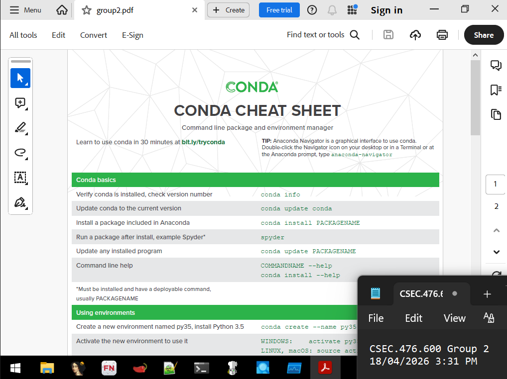

*Figure 24: PDF opened in Adobe Acrobat showing normal document content.*

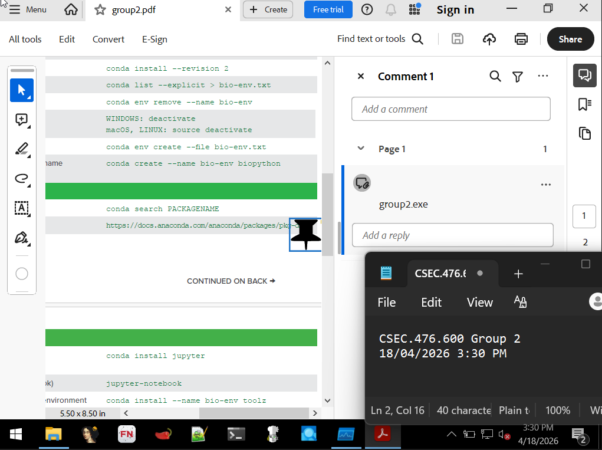

*Figure 25: Embedded file group2.exe visible inside the PDF.*

When trying to double click and open the embedded executable from within the PDF itself, Adobe Acrobat refused to do so and returned a warning message, that "The file type is not permitted to be opened from within the file because of attachment security restrictions."

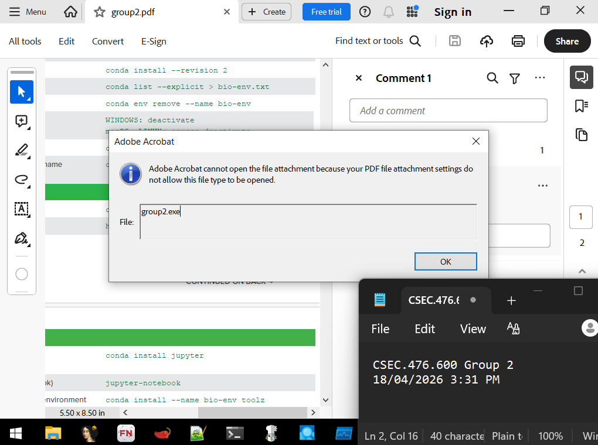

*Figure 26: Adobe Acrobat blocking execution of the embedded executable.*

What is important is that this proves that the PDF doesn't execute the embedded file automatically, but only shows the executable to the user, relying on him for the execution. The security features included in the PDF reader prevent from direct execution of the .exe and therefore the infected would only get the .exe out of the PDF.

This demonstrates the PDF to act as a delivery/social engineering vehicle and not an exploit document. The malicious action isn't caused by the rendering of the document, it occurs only after the executable embedded within the document has been executed individually.

#### Lab setup for detonation of the extracted executable
Since running the PDF-only did not achieve the callback, the embedded file 'group2.exe' was unpacked and detonated as a standalone file in an independent analysis lab. The following were the verified run-time parameters for the sample, c2host 212.22.1.3, TCP port 8082, payload windows/x64/meterpreter/reverse_https, listener bound on 0.0.0.0:8082.

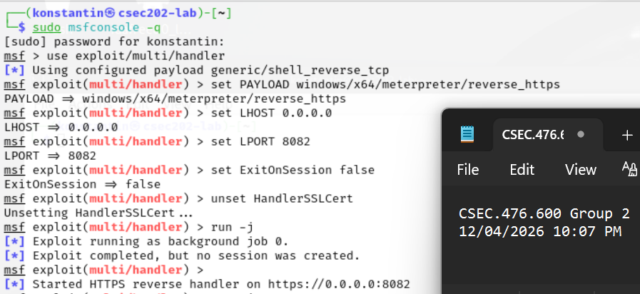

*Figure 27: Reverse HTTPS handler configured for staged execution on port 8082.*

The listener setup also seems to have a Metasploit multi/handler set up for windows/x64/meterpreter/reverse_https bound to 0.0.0.0 with LPORT 8082 and ExitOnSession set to false with no specified handler cert. This also indicates a staged Meterpreter callback.

Prior to detonation, active network capture was enabled starting from the Kali side so that the initial callback and stage transfer could be captured from the beginning of execution. This is crucial for stage analysis of malware, as usually the interesting network traffic appears in the first few seconds.

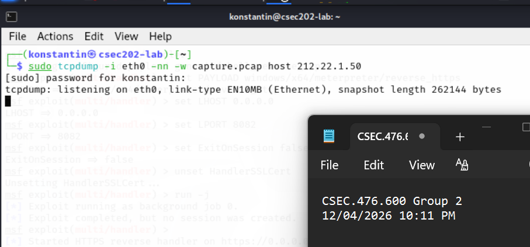

*Figure 28: Passive packet capture started before detonation of group2.exe.*

#### Runtime execution and stage delivery

As soon as group2.exe is run it is operating as the first-stage reverse HTTPS stager. The handler gets a request from victim host 212.22.1.50, announces "Staging x64 payload (249948 bytes)", then opens a Meterpreter session from 212.22.1.50 back to 212.22.1.3:8082. This is the primary runtime proof presented in the dynamic analysis portion, as it covers the complete stage 1-2 delivery sequence. Thus, the initial 7.5 KiB executable is not an implant in itself. It is instead a stager, with the goal of initiating the out-bound connection, making the request for the second component of the payload, receiving it into memory and transferring execution.

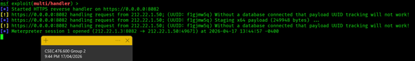

*Figure 29: Successful reverse HTTPS callback, delivery of the 204,892-byte stage, and creation of the Meterpreter session.*

The numbers seen in this sequence are also very telling. The bytes moved in the second stage (249948) suggest a Meterpreter DLL with reflection capabilities as it would not be expected of regular program code intended to be presented to the end user. The workflow documentation for this process also state that the TLS handshake was completed over port 8082 and that the accepted URI checksum was 139. This corresponds to an x64 Meterpreter reverse HTTPS stager pattern.

#### Process behavior of group2.exe
Staged-loader interpretation is further verified by observing the process execution. After being run, Process Hacker confirmed that group2.exe continued to run, loading more runtime modules expected for staged networking behavior.

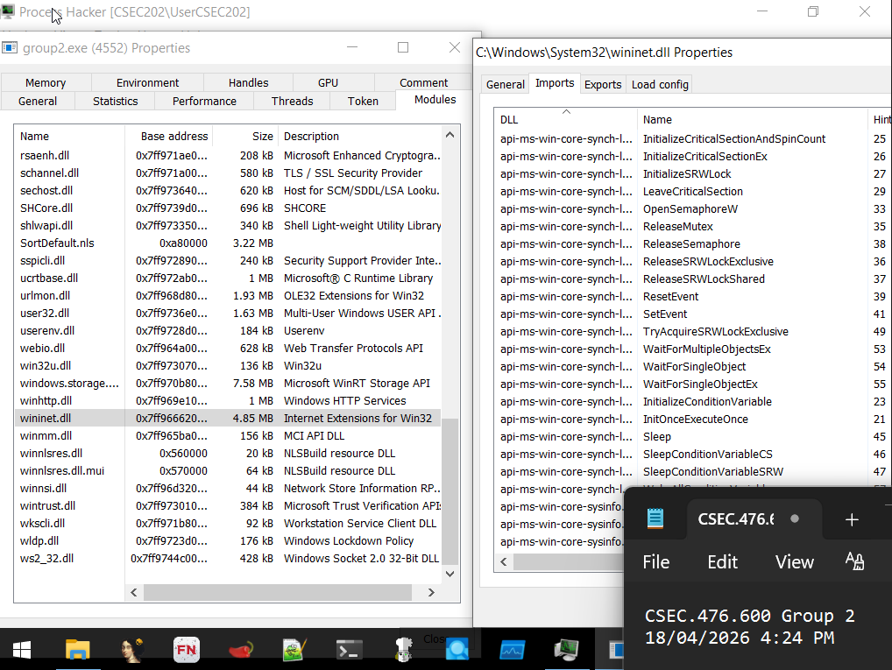

*Figure 30: Runtime module view of group2.exe, including dynamically loaded networking and TLS-related libraries.*

Looking at the runtime module view, the file group2.exe loaded wininet.dll at runtime. This is a notable because this supports our earlier finding of network capability based on string names and the loader structure without static import data. Also, related helper libraries such as ws2_32.dll, schannel.dll, sspicli.dll, urlmon.dll, and a variety of bcrypt libraries also are loaded. Each of these is in agreement with a web-based staging behavior with TLS enabled. Running the sample independently also registered LoadLibrary calls for wininet, and reported WININET as a loaded module for the process. Together, this evidence suggests the sample dynamically loaded it networking and supporting runtime libraries as part of the staging process.

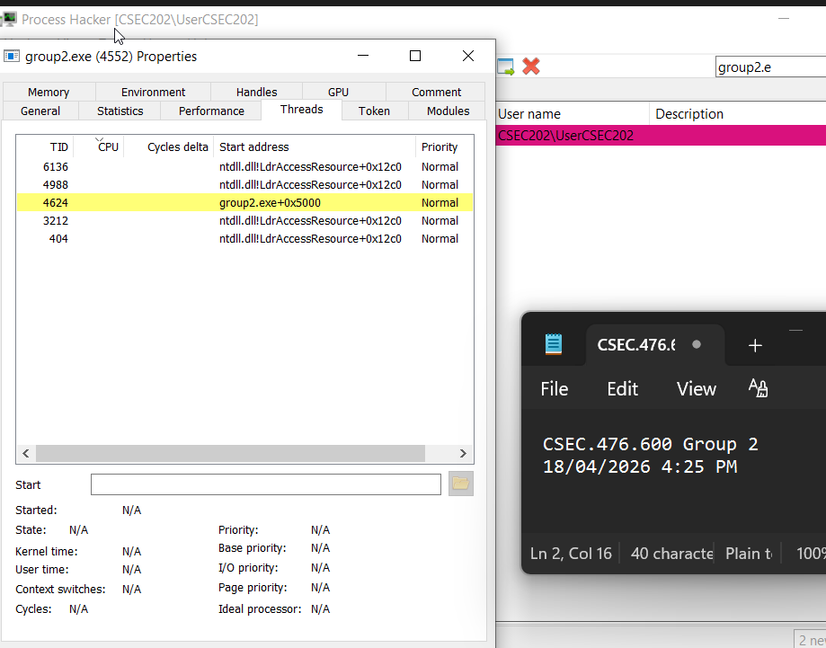

*Figure 31: Thread activity observed in group2.exe during live execution.*

The thread view indicates that after staging occurs, the process continues running with many threads. For this sample, this is as expected and would correspond to a handoff from the initial stub to the downloaded in-memory function. You see one thread beginning execution at group2.exe+0x5000, which is in line with the process starting with execution within the actual executable prior to the additional stage being downloaded into and hosted in memory. Thus, the observed multi-threaded running state would be expected for a staged loader rather than a bare single-path executable.

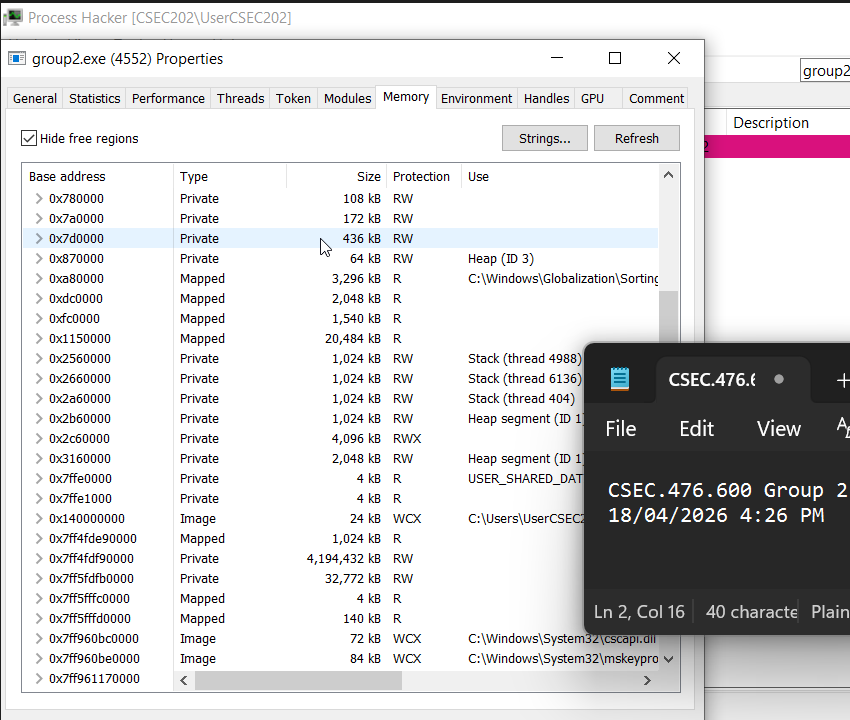

*Figure 32: Memory view of group2.exe, showing a large private RWX region during live execution.*

The memory view also backs up the staged-loader hypothesis. An approximately 4096KB region of private memory, having RWX protection is pictured. It is uncommon for a benign application to have such a large region, let alone one that is executable in runtime-this is consistent with how an application might have loaded its shellcode, or in our case, a delivered, stage 2 stage, into memory space. In an HTTPs-based staged reverse, this would be an excellent place for a network-delivered second stage payload to rest in memory after its retrieval. This further opens up a path into the later, more advanced, dynamic analysis where the saved memory image can be inspected directly to confirm the contents of that memory region.

Runtime analysis logs an InternetOpenA with a chrome-like user agent, HttpOpenRequestA, a dynamic GetProcAddress for loads of different functions, loadlibrary for the wininet module etc. It also extracts the c2 url parts https://212.22.1.3:8082/ and a long staging uri. HTTP request strings such as GET /DoSaKUGGHJcVXRRffO9-... HTTP/1.1 can be recovered. These match up with the live listener analysis and prove that the executable utilizes a TLS-based HTTP workflow.

#### Registry behavior of group2.exe

The runtime registry access for group2.exe also aligns with an environment-aware network stager. Group2.exe opens and queries registry keys related to Session Manager, Segment Heap, SafeBoot, SRP\GP\DLL, SAFER\CodeIdentifiers, policy for file system operations, compatibilities for executables ( AppCompat flags), Explorer user directories (shell folders, etc.), user desktop language preferences, locale settings, and service configuration / Winsock. From these accesses, one can infer that the executable is determining execution policy, its compatibility state (XPSP2, Vista, etc), various cache paths, languages, and network config (among other things) at some point before or during the staging phase.

The same evidence of runtime logs query a number of Internet Settings and Internet Explorer's security values, such as DisableCachingOfSSLPages, BypassHttpNoCacheCheck, BypassSslNoCacheCheck, WarnOnHttpsToHttpRedirect and DisableSecuritySettingsCheck. These checks suggest an understanding of host behavior concerning HTTPS and security related issues regarding the web browser as well as cache mechanisms. Further to these checks, the process retrieves the ProcessMitigationPolicy, information about kernel-debugger, system version, product type, and active computer name. This is indicative of an stager collecting host environment information and assessing conditions for second-stage retrieval.

Also multiple values are wrote in HKCU\Software\Microsoft\Windows\CurrentVersion\Internet Settings\ZoneMap including ProxyBypass, IntranetName, UNCAsIntranet and AutoDetect. It is notable that this process wrote to such values as it not only checks host settings but actively modify user internet-zone setup, this would make sense if it is trying to influence and configure the environment in which its web-based staging traffic pass through.

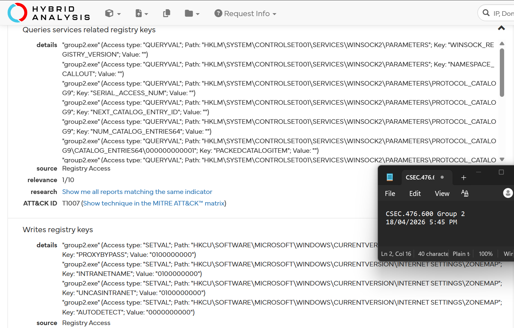  

*Figure 33: Registry changes recorded after execution of group2.exe.*

#### Live post-exploitation interaction

Once the reverse HTTPS callback completed and the 204,892 byte second stage was sent, opening the meterpreter session confirmed the stage was working and had been loaded on the victim host. Running sessions, then session 1: confirmed the existence of an meterpreter x64/windows session to the victim host. Executing sysinfo, identified the target hosts operating system as Windows 10 x64 and confirmed the target host was called CSEC202. Executing getuid showed that the current operating system user was CSEC202\UserCSEC202, the process list confirmed that a session was established to the target host with a meterpreter stage located in C:\Users\UserCSEC202\Downloads\group2.exe

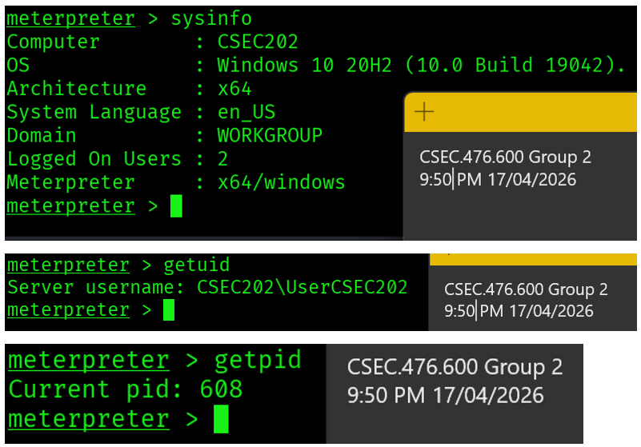  

*Figure 34: Live post-exploitation interaction through meterpreter*

#### TLS Handshake and C2 Communication

The Wireshark capture of the TLS handshake indicated that the outbound connection to 212.22.1.3:8082 negotiated TLS 1.2 and underwent all of the server-side handshake packets as is expected (Server Hello, Certificate, Server Key Exchange, Server Hello Done). It is also evidence that the command and control server was not only reachable at the TCP level, but was operating a TLS capable listener at that port during execution.

Upon inspection, it was found that the Issuer and Subject were identical, revealing it to be a self-signed certificate. This certificate included the values C=US, ST=TX, O=Konopelski-Spinka, OU=back.up, CN=konopelski.spinka.co, and emailAddress=back.up@konopelski.spinka.co. The validity period was between 2022-06-03 04:57:30 UTC and 2026-06-02 04:57:30 UTC. None of these fields suggest a common public web-service certificate, but rather suggest some self-generated or attacker-controlled TLS infrastructure.

The arrangement of the certificate appears highly consistent with Metasploit's self-signed certificates. The Rapid7 documentation, and source discussion, indicates that Metasploit is capable of producing values for the certificate subject fields by use of Faker supplied values for: Organization, Organizational Unit, Common Name, and Email Address, and that Rapid7's description of the example pattern is very similar to the example seen here, particularly the OU=back.up value which seems particularly odd.

Taken in isolation, the dynamic TLS information dynamically confirms the static finding that the sample is a reverse HTTPS stager and can connect to a listener which presents a self-signed, untrusted certificate. The certificate information should be regarded as a probably framework-derived data point, and not a concrete attribution concerning the operator's nationality or native language. While it might look like Slavic from a quick examination, the .glav custom PE section name doesn't necessarily imply a Slavic nation of origin.

  

Figure 35: Expanded TLS certificate details for the listener at 212.22.1.3:8082. The certificate is self-signed, with matching issuer and subject fields, and its unusual metadata pattern, especially OU=back.up, is strongly consistent with Metasploit-generated certificate artifacts rather than a legitimate public HTTPS certificate

### Advanced Dynamic Analysis
The advanced dynamic analysis of the sample focused on dynamically verifying the execution of the stager from both a memory and live debugging context. Beyond simply proving that group2.exe was executed it was crucial to demonstrate that group2.exe was loaded in memory, dynamically loaded its networking stack, successfully established live C2 with 212.22.1.3:8082, and utilized the resolver-based path that was discovered during static analysis. This was the envisioned advanced-dynamic workflow that could be implemented for this sample and highlights the utility of acquiring a memory dump and using Volatility to verify active processes and network information and the debugger to verify the hashed API dispatch through the resolver stub.

#### Memory acquisition and Volatility framework validation
While the Meterpreter session to the detonation host was still live, a full memory image of the host was captured using WinPmem. Capturing live RAM is crucial, as the second-stage payload is transmitted and executed within memory, thus the volatile evidence will be lost upon process termination or power down. The obtained memory image, memory.raw, was then analyzed using Volatility 3. The windows.info plugin executed and successfully parsed the memory image, resolving all required symbols, thus verifying the integrity of the memory image. The output identified a 64bit Windows operating system and returned the required kernel information for processes, networks, and address space examination.

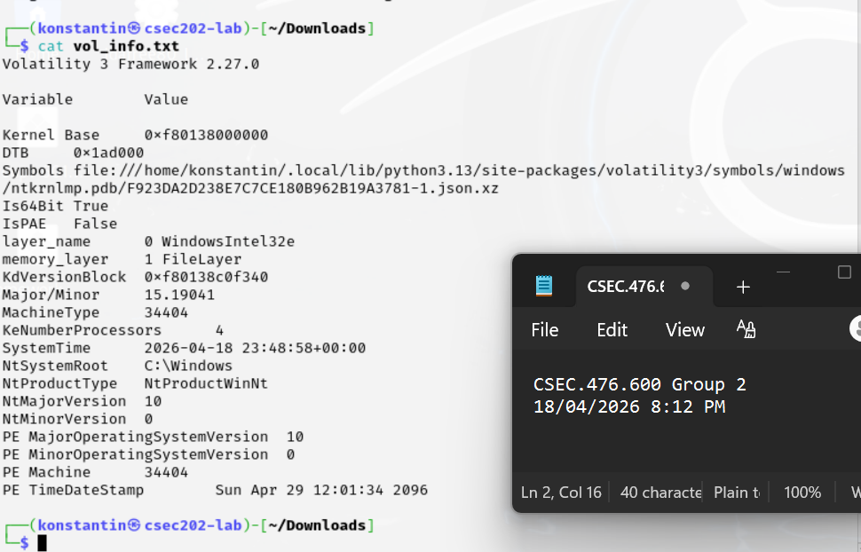  

*Figure 36: Volatility windows.info output confirming that the captured memory image is valid and readable for forensic analysis.*

#### Malware process persistence in memory
Volatility windows.pslist gave a PID of 2644 to the malware and also identified the image as containing the image-taking program, this therefore proves that memory acquisition happened in the live, post-compromise state. This is a good result, as it shows the malware was still resident in memory and didn't vanish before memory acquisition.

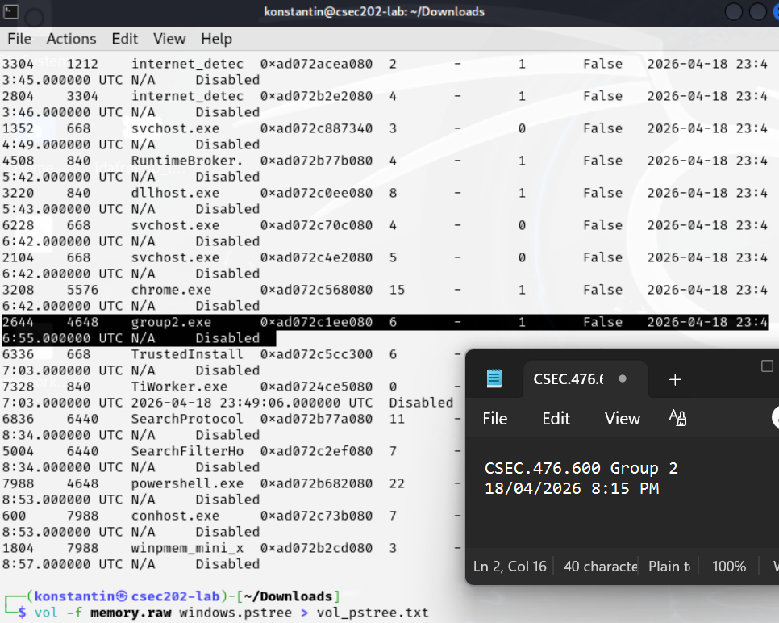  

*Figure 37: Volatility windows.pslist output showing group2.exe present in memory at the time of capture.*

#### Runtime-loaded networking and TLS libraries
Volatlity Windows.dlllist shows that WinInet.dll had been loaded in the context of the malware process. This represents one of the major dynamic-advanced indicators as it reinforces static analysis that this sample likely did not have a traditional import table disclosure of WinInet APIs and instead linked to necessary functions in a dynamic fashion. The in-memory Dlllist provides proof of this fact. Beside WinInet.dll, it shows multiple related dynamic-linked libraries had been loaded in the process of the malware. These libraries included WS2_32.dll, urlmon.dll, schannel.dll, SspiCli.dll, winhttp.dll, and bcryptPrimitives.dll. This information leads one to conclude that it had dynamically linked the Windows networking and cryptography libraries needed to implement and maintain the reverse HTTPS session.

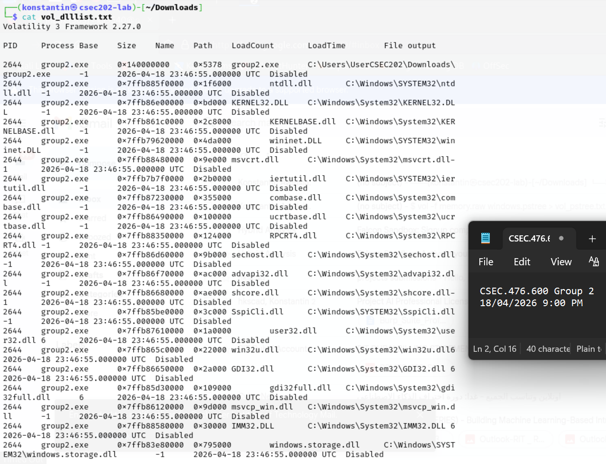  

*Figure 38: Volatility windows.dlllist output for group2.exe, showing runtime-loaded wininet.dll and supporting networking/TLS libraries.*

#### Memory-side confirmation of the live C2 channel
The best evidence discovered for Volatility networks was from the windows.netscan plugin that displays an ESTABLISHED TCP session which was originating from group2.exe at the local IP address of 212.22.1.50 to 212.22.1.3 on port 8082. This artifact was very useful because it proved a link between the process, the machine, and the destination over the network while within the memory image. This verified, on its own, the same communication path shown through live handler communication and corresponded directly to the C2 variables discovered through the static and dynamic analysis. Instead of being confined to only using the Metasploit listener, the memory forensics confirmed the HTTPS connection out of the malware process was being made when the RAM was captured.

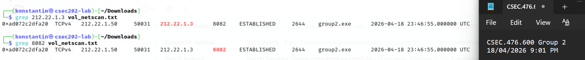  

*Figure 39: Volatility windows.netscan output showing an established connection from group2.exe to 212.22.1.3:8082.*

#### Process-attributed registry and networking context from handle analysis
Process analysis: Handle analysis showed yet another process attributed view of runtime behavior. The Volatility windows.handles command gave opened objects that were directly related to group2.exe (contrary to the whole-system registry snapshot comparisons that was too noisy to examine earlier in the investigation). It showed the malware process as possessing keys associated with Internet Settings, Internet Explorer\Main, Internet Explorer\Security, and Internet Settings\ZoneMap, as well as winsock catalog paths like Protocol_Catalog9 and Namespace_Catalog5. This is a significant result because it shows that the process not only had network capabilities, but was examining the configuration objects that govern how Windows behaves when handling internet traffic and sockets. It is evidence consistent with network-aware stagers.

  

*Figure 40: Volatility windows.handles output showing group2.exe opening Internet Settings and ZoneMap-related registry objects.*

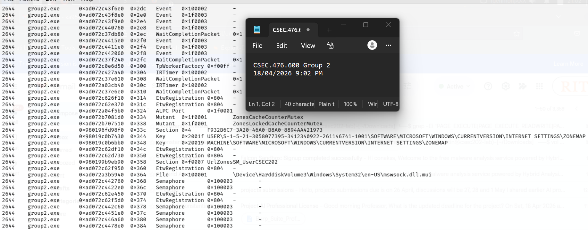  

*Figure 41: Volatility windows.handles output showing group2.exe opening Internet Explorer and Winsock-related registry objects.*

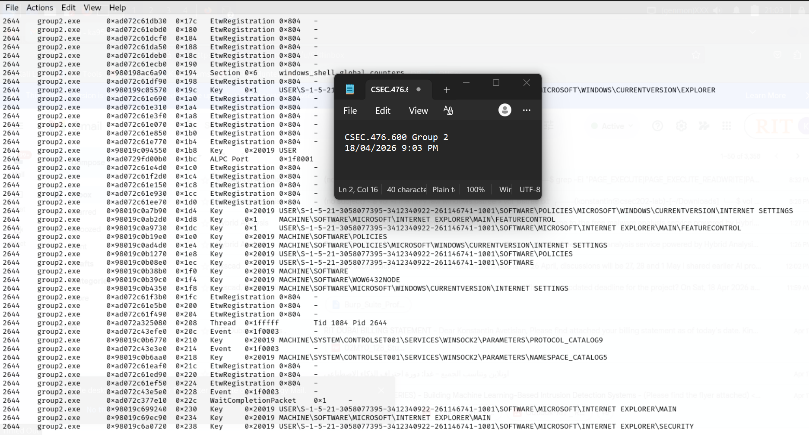  

#### Live debugger confirmation of entry-point and resolver execution
In addition to memory forensics, the sample was also live traced in x64dbg. It was observed that the execution jumps directly to 0x140005000-the start of the non-standard .glav section. This is an important finding as it confirms the executable is not falling into a normal application code path first and then transitioning to the shellcode-like loader body. Rather it goes directly into the loader body as expected from the static analysis of the custom RWX section and stager. Shortly thereafter, the control is transferred to the resolver stub at 0x1400050D6, confirming the runtime path uses the dynamic API-resolution mechanism discussed earlier. The dynamic/advanced guide considers this resolver breakpoint the primary x64dbg anchor point to dynamic tracing of hashed API dispatch.

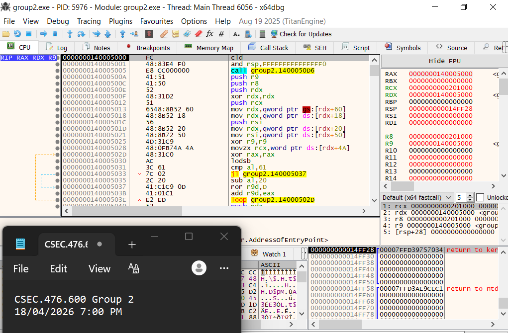  

*Figure 42: x64dbg showing execution beginning at 0x140005000 inside the custom .glav section.*

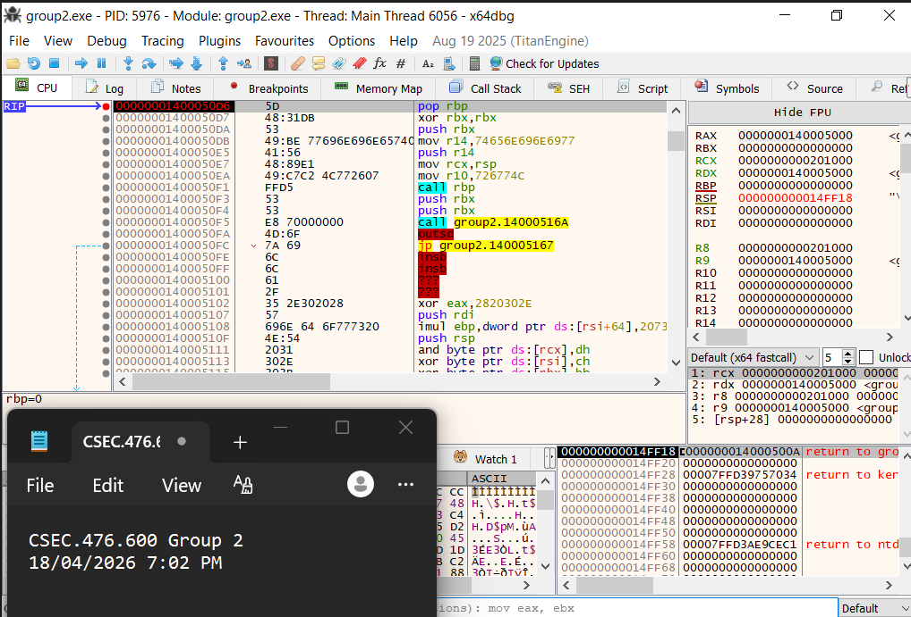  

*Figure 43: x64dbg breakpoint hit at 0x1400050D6, confirming live transfer of execution into the resolver stub.*

#### Live hashed API dispatch: library loading
An x64dbg breakpoint later on intercepted the execution at a call rbp dispatch site where r10 was 0x0726774C. This value was previously correlated with the hash of LoadLibraryA, therefore providing definitive proof in the live execution of this fact, that the stager dispatches to Windows API calls with hashed names rather than a normal import table. The result of this discovery is highly significant in that it correlates the statically found hashing resolver logic within the disassembly and its live usage within the debugger. The initial call is appropriate for when wininet is loaded during the initial staging execution before an HTTP request is issued outbound.

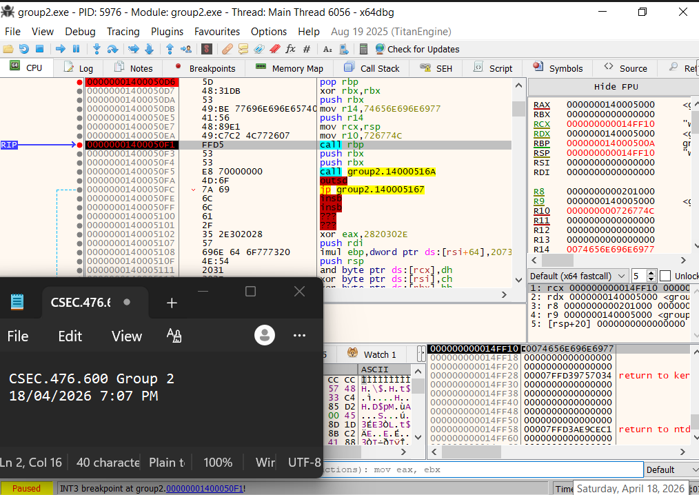  

*Figure 44: x64dbg stopped at a live call rbp dispatch site with r10 = 0x0726774C, consistent with LoadLibraryA.*

#### Live hashed API dispatch: outbound connection setup
The next x64dbg breakpoint yielded an even more compelling piece of information about the path used by the network infrastructure. The breakpoint at 0x1400051AE again breaks on call rbp; however r10 = 0xC69F8957 which we previously know is the hash for InternetConnectA. Simultaneously, r8 = 0x1F92. In decimal form this is 8082. It is one of the most precise pieces of evidence obtained using the advanced-dynamic analysis technique, since it demonstrates a correlation between the API dispatch at runtime, the accurate wininet connection function used, and the explicit C2 port revealed from the static and dynamic analysis phases. From this, it can be confidently said that the resolver-based calling mechanism within the stager is used not for simply calling library functions, but for the explicit building of the outgoing reverse https connection to the listener address.

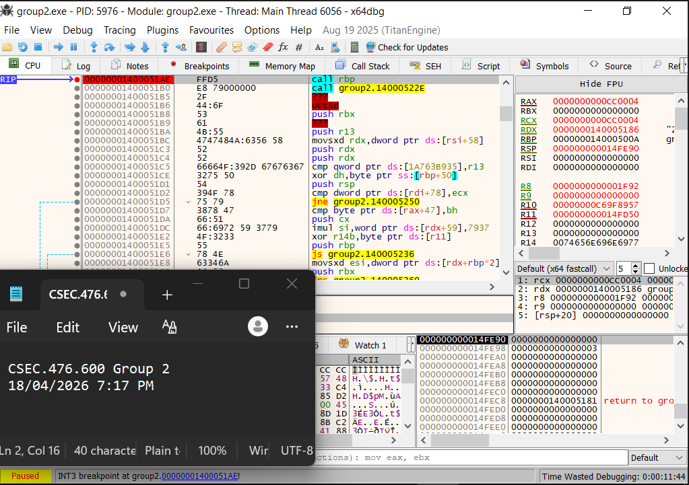  

*Figure 45: x64dbg stopped at 0x1400051AE during a resolver dispatch where r10 matches InternetConnectA and r8 = 0x1F92 confirms use of port 8082.*

#### Interpretation of advanced dynamic findings
Collectively, the advanced-dynamic findings are a conclusive corroboration of the interpreted behavior of the sample as a whole. The memory analysis demonstrates group2.exe had live presence within RAM, it had loaded the WinINet network/TLS support libraries, and it owned the created TCP connection established to 212.22.1.3:8082. Handle analysis confirms the process accessed the Internet Settings, ZoneMap, IE security paths, and Winsock config objects. The live debugging additionally confirms program execution begins within the shellcode loaded section (.glav) and then moves to the resolver stub and sends the appropriate hashed API calls for the same library loading and outgoing connection established. These indicate that the sample operates as a resolver based reverse HTTPS stager and that the behaviors demonstrated at run time are in agreement with the deduced Metasploit windows/x64/meterpreter/reverse_https scenario.

## Findings
- Initial Delivery Vector: The original malicious artifact was group2.pdf, which was a PDF 1.7 document. It contained a single /EmbeddedFile object pointing to the attachment group2.exe. There was no use of JavaScript, /OpenAction, or /Launch abuse and so the PDF was a transport for the executable, not an exploit. PDF SHA-256: 3ce840cc49a1beef743274dc7fe29d2ff9aa17e00afcd3a386e908dca3539133.
  
- Embedded executable payload: The malicious PE extracted from the PDF was group2.exe, a 64-bit Windows loader with SHA-256 89dfbfeda4ec1d4f6d28ab376cc28468f42f98ccc694cd8e9a5033a34c2f7a7b and MD5 0ce70f0f07c21bf4290a1c0308fc4f46. Its compact size, unique .glav RWX section and single-entry IAT is representative of staged shellcode loader.
  
- C2 communication: malware performs reverse HTTPS connection on 212.22.1.3:8082. Static analysis found the hardcoded IP address, URI and port logic. Debugged with x64dbg, found a live hashed InternetConnectA dispatch, 0x1F92 is confirmed, Volatility netscan indicates an established TCP connection which is belong to group2.exe.

- Remote access ability: The malware achieved its objective in staging and launching a Meterpreter session, therefore fully demonstrating remote access capability. Although a direct capture of user files and user credentials was not taken, the Meterpreter session being opened does reflect that the compromised machine was available remotely for reconnaissance, file access, credential harvesting, and ultimately exfiltration.

#### Indicators of compromise (IOCs):

PDF SHA-256: 3ce840cc49a1beef743274dc7fe29d2ff9aa17e00afcd3a386e908dca3539133

EXE SHA-256: 89dfbfeda4ec1d4f6d28ab376cc28468f42f98ccc694cd8e9a5033a34c2f7a7b

EXE MD5: 0ce70f0f07c21bf4290a1c0308fc4f46

Embedded filename: group2.exe

C2 host: 212.22.1.3

C2 port: 8082/TCP over HTTPS

Full C2 URL: https://212.22.1.3:8082/DoSaKUGGHJcVXRRffO9-ggcg2uPT9Oxuy8xGfQfirY7yO23UxNc4jDSyqGoZ7c040azjJqAMGe4nUjWYYXyEajzPQIC5LT9OUMP4ysU35sPczVGyXNyMZra

URI checksum: 139 (URI_CHECKSUM_INITW_X64)

User-Agent: Mozilla/5.0 (Windows NT 10.0; Win64; x64) AppleWebKit/537.36 (KHTML, like Gecko) Chrome/131.0.0.0 Safari/537.36

Custom PE section: .glav

Runtime-loaded modules: wininet.dll, WS2_32.dll, schannel.dll, urlmon.dll, winhttp.dll, bcryptPrimitives.dll

---

## Conclusion
This malware is a high-risk document-delivered staged reverse HTTPS loader. The first artifact is a pdf file group2.pdf and its aim is to store a second binary group2.exe inside it and deliver it to the target. However, group2.exe is no ordinary program, but a tiny shellcode-based stager which executes within a custom made RWX section, resolving all necessary WinAPI functions using a hashing mechanism and late loading its networking library, while connecting to the C2 server at 212.22.1.3:8082 to then stage and fire a Meterpreter payload.

The main takeaway is that there are actually two tightly related artifacts in this attack and not just one: the PDF acts as the delivery payload and the EXE acts as the live stager. To consider only the executable malicious would be to miss a crucial part of the chain of compromise as the PDF is a meaningful IOC and the point where the user is first exposed to the threat. Overall the static, dynamic, memory and debugger analysis shows a cohesive end-to-end workflow where a user interacts with an embedded PDF attachment leading to a live, reverse HTTPS command-and-control infrastructure. This sample, from an operational perspective, should be considered a genuine remote access threat that could provide the means for follow-on compromise actions (e.g. Reconnaissance, establishing persistence, exfiltration).

---

## Team Contributions
Konstantin Avetisian contributed to the static and dynamic analysis process, evidence collection, screenshot preparation, writing and revising report sections, final formatting and editing of the report, and publishing the completed writeup on GitHub Pages.

Ayush Gowda contributed to the static and dynamic analysis of the sample, validation of findings, and review of technical content included in the report.

Nikita Astionov contributed to the reverse-engineering and technical interpretation of the malware’s behavior, and assisted with review of the analysis results presented in the report.

Youssef Elgayar contributed to the investigation, interpretation of findings, and review of the final written report before submission.
