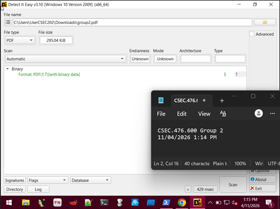

# project-csec476-group2
Malware analysis project including static and dynamic analysis of a real-world sample, with detailed findings, reverse engineering, and network behavior investigation.

# Malware Analysis Report - Group X

## Team Members
- Name – ID
- Name – ID

## Table of Contents
- Technical Summary
- Static Analysis
- Dynamic Analysis
- Advanced Analysis
- Conclusion

---

## Technical Summary
(1 page summary of what malware does)

---

## Static Analysis

This section documents both Basic and Advanced Static Analysis of the sample
assigned to Group 2. The original sample was distributed as a PDF file
(`group2.pdf`); the analysis began with file-type identification and the
extraction of an embedded Windows executable from inside the PDF, then proceeded
to full reverse engineering of the extracted binary. All screenshots were taken
on a FLARE-VM Windows 10 analysis VM and a Kali Linux VM, with the group
identifier and system timestamp visible in each image.

### Basic Static Analysis
#### Initial file identification
The sample as delivered was a 295 KiB file named `group2.pdf`. Detect It Easy
(DIE) v3.10 was used to confirm the file type before any further interaction.

*Figure 1: Detect It Easy identifies `group2.pdf` as `PDF(1.7)[with binary
data]`. The "with binary data" tag is a strong hint that the PDF carries
a non-textual payload such as an embedded file or stream.*

#### PDF triage with pdfid

Didier Stevens' `pdfid.py` was used to enumerate suspicious PDF object types.
The tool counts occurrences of every keyword that is commonly abused to embed
or trigger malicious content (`/JavaScript`, `/Launch`, `/EmbeddedFile`,
`/OpenAction`, `/AA`, `/JS`, `/AcroForm`, etc.).

### Advanced Static Analysis
- Disassembly (IDA)
- API analysis
- Obfuscation techniques

---

## Dynamic Analysis

### Basic Dynamic Analysis
- Behavior
- Network traffic
- Processes

### Advanced Dynamic Analysis
- Debugging
- Memory analysis
- Persistence mechanisms

---

## Findings
- C2 communication (Telegram, etc.)
- Data exfiltration
- Indicators of compromise

---

## Conclusion
(what malware does, risk level, key insights)

---

## Team Contributions
- Who did what
